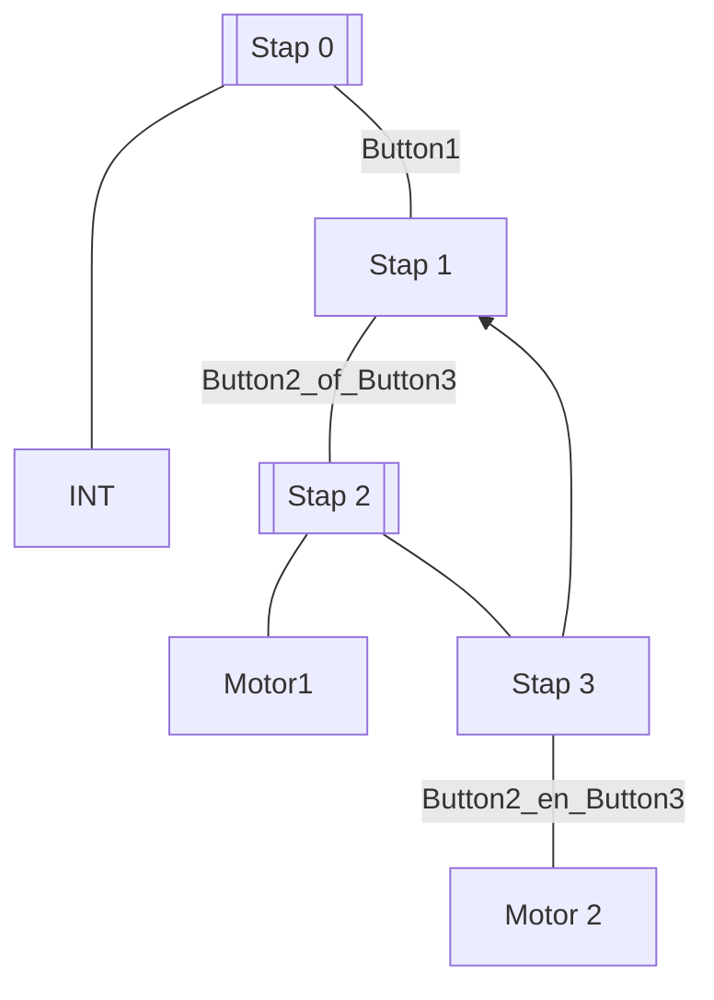

# Inhoudsopgave
```toc
```
---
## Move
![[Pasted image 20230502085215.png]]

## ADD en SUB
```pascal
#TempA - 5; // Kan niet
#TempA -= 5; //Kan wel
```

## Convert (CONV)

## Counters
```pascal
IF "Clock_1Hz" THEN
	"Testint" := "Testint" + 1;
END_IF;
```

Dit werkt niet omdat de waarde omhoog blijft gaan terwijl de cyclus bezig is.

Daarom gebruiken we een counter
```pascal
"IEC_Counter_0_DB_1".CTU(CU := "Clock_1Hz"
						 PV := 100
						 CV => "Testint"
);
```

Sys_running is standaard 0
```pascal
IF "Sys_running" = 0 THEN
	"IEC_Counter_0_DB_1".CTU(CU := "Clock_1Hz"
						 PV := 100
						 CV => "Testint");
	 Sys_running := 1;
END_IF;
```
Dus na de eerste cyclus zal de **IF** waarde **false** zijn daarna zal de counter wel blijven doortellen.

Er zijn 3 ingangen bij de counters 
`CU_Counter.CU` verhoogt de counter
`CU_Counter.R` reset de counter naar 0
`CU_Counter.PV` geeft de eindwaarde van de counter aan

---

## Rising en falling edge
![[Pasted image 20230502092344.png]]
Bij een *rising edge* wordt er pas een signaal gedetecteerd als je van **laag** → **hoog** gaat. (Wordt soms ook *positive edge* genoemd)

Bij een *falling edge* wordt er pas een signaal gedetecteerd als je van **hoog** → **laag** gaat. (Wordt soms ook *negative edge* genoemd)

## Scaling en Normalisation
**Scaling** gebruikt de hoogste en laagste waarde om de input waarde te mappen van 0 → 1
**Normalisation** verandert het perspectief vanuit waar je kijkt naar de geschaalde waardes.

## RS of SR flip flops
Met een RS of SR flip flop kan je het geheugen van een bit aanzetten of resetten.

### SR (SET RESET)
Bij een **SR** heeft de RESET prioriteit 

### RS (RESET SET)
Bij een **RS** heeft de SET prioriteit 

## SFC (Sequential Function Chart)

