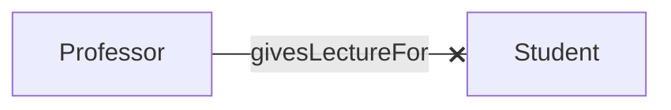
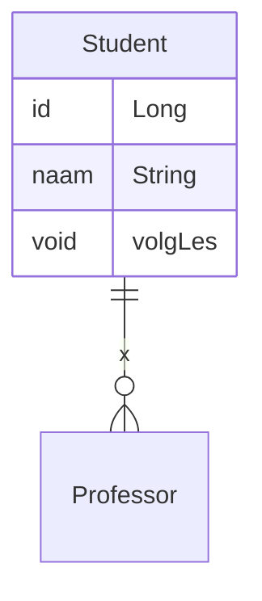
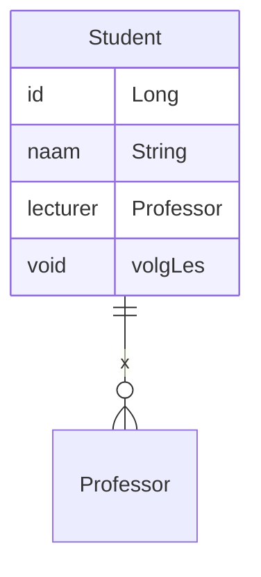
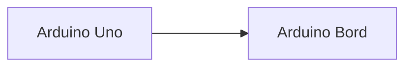
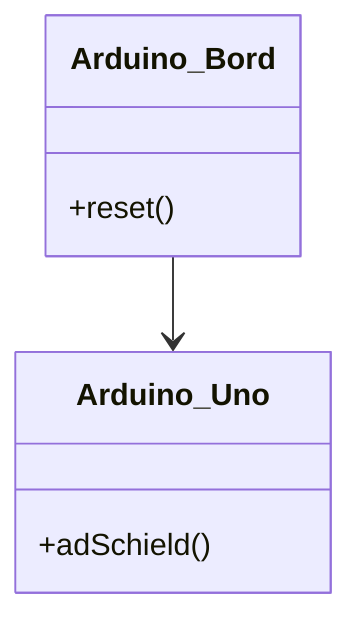
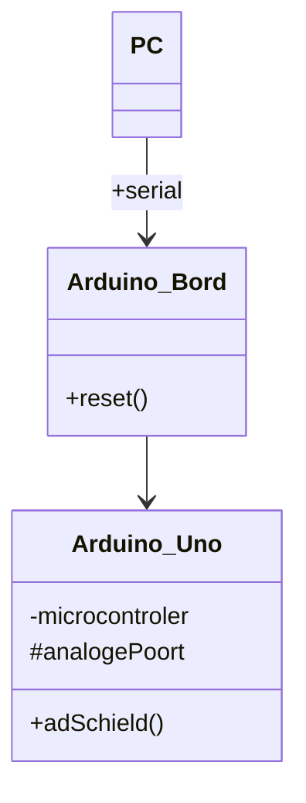

# Inhoudsopgave
```toc
```

## Encapsulation

Bij encapsulation zie je dingen op een **need-to-know** basis. Zo krijg je dus alleen relevante informatie

```cpp
class Servo {
public:
	Servo(); 
	uint8_t attach(int pin); uint8_t attach(int pin, int min, int max); 
	void detach(); 
	void write(int value); 
	void writeMicroseconds(int value); int read(); 
	int readMicroseconds(); 
	bool attached(); 
private: 
	uint8_t servoIndex; 
	int8_t min; 
	int8_t max; 
};
```

| Symbol |           | Betekenis                                                                       |
| ------ | --------- | ------------------------------------------------------------------------------- |
| +      | Public    | Toegankelijk voor alle andere objecten                                          |
| -      | Private   | Privé, enkel binnen het object beschikbaar                                      |
| *#*    | Protected | Toegankelijk voor het object en objecten die een subklasse van het object zijn. |
| *~*    | Package   | Toegankelijk voor alle objecten in dezelfde package.                                                                                |

---

## Associaties tussen klassen


- Multipliciteiten. Deze geven een hoeveelheid aan.
- Hier geeft het sterretje aan: “0 of meer”. 
- Algemene vorm is min .. max dus bv: 0..3 betekent 0 t/m 3
- I.p.v. max kun je ook `*` invullen als er geen maximum is. Dus `2..*` betekent ‘twee of meer’.
- `*` is een afkorting voor `0..*`

---

- In de notatie wordt het kruis vaak niet gebruikt. De pijl geeft dan nog steeds aan wat bedoeld wordt.
- Een pijl twee kanten op kan ook: 
- Formeel betekent een lijn zonder pijlen – hetzelfde als een pijl twee kanten ↔ op, maar je zult ook tegen komen dat hier bedoeld wordt dat nadere informatie over navigeerbaarheid ontbreekt.


  Als code zou deze associatie er alsvolgt uitzien
```cpp
class Student { 
public:
	Professor lecturer[5]
	//en de rest
}
```

```cpp
class Professor {
	//en de rest
}
```

---

![[Pasted image 20230501110703.png]]

- De visibility van attributen is ook te zien in het model

---

### Rol-namen en Attributen 
Correct


Incorrect


---

## Overerving (Inheritance)



Het *Arduino bord* is hier de **parent** of **super** class 

De *Arduino Uno* is hier de **child-** of **subclass**

---

- Parent Class 
	- Meest generiek
- Child Class
	- Meest specefiek
	- Erft **operaties** , **attributen en associaties** van de parent class.






Eerder waren *protected classes* gegeven Je kan deze alleen gebruiken in de **eigen** klas en in de **subklassen**

---
In dit voorbeeld wordt er inheritance gebruikt d.m.v. de dubbele punt.
```cpp
class ArduinoBord {
…
protected:
int analogePoort;
}
class ArduinoUno : public ArduinoBord {
// AnalogePoort is hier beschikbaar
}
```
