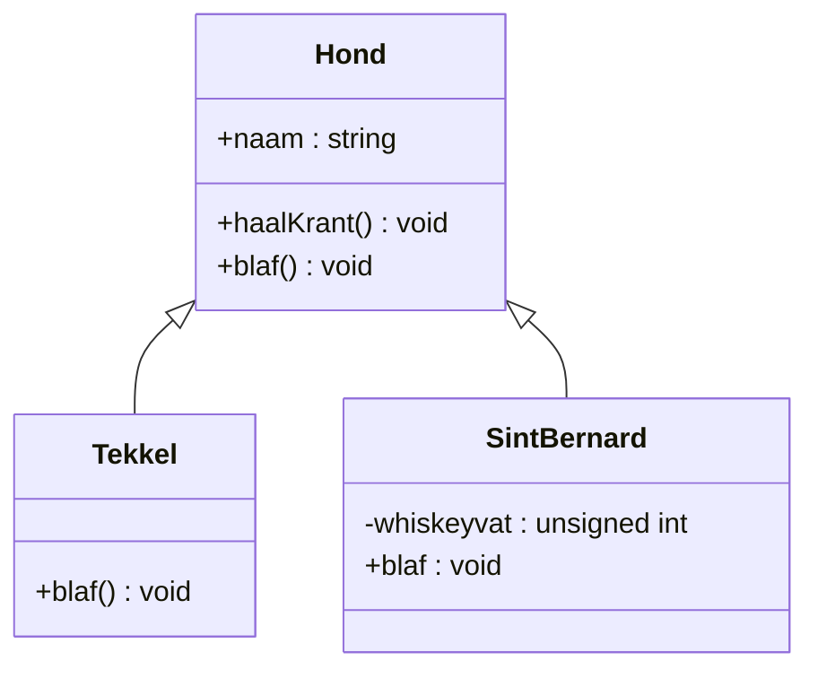

# Inhoudsopgave
```toc
```

## Overerving

```cpp
class Hond {
	private:
		string naam;
	public:
	    Hond(string);
	    void haalKrant();
	    void blaf();
};

```

Met klasse Hond kan je andere typen honden aanmaken door middel van **overerving **
Voorbeeld
```cpp
class Tekkel : public Hond{
	public:
		Tekkel(string);
		void blaf();
};
```

```cpp
class SintBernard :public Hond{

  public:

      SintBernard(string, int)

    void blaf();

  private:

     int whiskeyvat;

};
```

Je kan nu een `Tekkel` aanmaken met een <span style="color:red">constructor</span> 
Een voorbeeld van hoe je een Tekken aanmaakt is
```cpp
Tekkel tk1("Rocky")
```

Je geeft hierbij een **String** mee dit staat in de class Tekkel ook als type voor de <span style="color:red">constructor </span> 


---



De Tekkel heeft zoals je hier ziet een eigen blaf functie
```cpp
void Tekkel::blaf() {
    cout<<naam<<" keff keff"<<endl;
}
```
De Sint Bernard heeft ook een eigen blaf functie

```cpp
void SintBernard::blaf() {
    cout<<naam<<" woef woef"<<endl;
}
```

Daarnaast heeft de hond de functie
```cpp
void Hond::haalKrant() {
    // ...
    blaf();
}
```

Maar als je deze gebruikt bij de Tekkel en/of  Sint Bernard zal deze de blaf functie van de hond gebruiken en niet zijn eigen

Dit kan je voorkomen met de  keyword <span style="color:blue">virtual</span> 
```cpp
class Hond {
	private:
		string naam;
	public:
		void blaf();
		virtual void blaf();
};
```

---

## Polymorfisme 
Stel we maken een nieuwe functie **doeJeWerk** in de class **Hond**
```cpp
void doeJeWerk(Hond& h) {
        h.haalKrant();
        // ...
}
```

We kunnen dan met het &-teken aangeven dat ``Hond`` als `h` kan woorden gebruikt. 

- Polymorfisme werkt alleen bij <span style="color:blue">& en *(pointer)</span> 

## **A**bstract **B**ase **C**lass
- Er kunnen geen objecten (variabelen) van een ABC gedefinieerd worden.

- Een class die overerft van Hond en blaf() override is geen ABC meer.

- Een class die overerft van Hond en blaf() niet override is een ABC.
```cpp
class Hond {
private:
    // ...
public:
    Hond(string);
    void haalKrant();
    virtual void blaf() =0;
    // ...
};

void Hond::haalKrant() {
    // ...
    blaf();
}
```
Als je nu probeert een Sint Bernard aan te maken dan zla dit niet kunnen omdat de Hond klas abstract is.
```cpp
class SintBernard: public Hond {
  public:
     SintBernard(string,int);
     virtual void blaf() {
          cout<<”WOEF”<<endl;
     }
  private:
     int whiskeyvat;
};
```