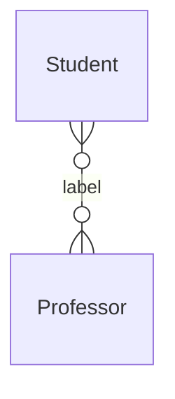

# Inhoudsopgave
```toc
```

## Encapsulation

Bij encapsulation zie je dingen op een **need-to-know** basis. Zo krijg je dus alleen relevante informatie

```cpp
class Servo {
public:
	Servo(); 
	uint8_t attach(int pin); uint8_t attach(int pin, int min, int max); 
	void detach(); 
	void write(int value); 
	void writeMicroseconds(int value); int read(); 
	int readMicroseconds(); 
	bool attached(); 
private: 
	uint8_t servoIndex; 
	int8_t min; 
	int8_t max; 
};
```

| Symbol |           | Betekenis                                                                       |
| ------ | --------- | ------------------------------------------------------------------------------- |
| +      | Public    | Toegankelijk voor alle andere objecten                                          |
| -      | Private   | Privé, enkel binnen het object beschikbaar                                      |
| *#*    | Protected | Toegankelijk voor het object en objecten die een subklasse van het object zijn. |
| *~*    | Package   | Toegankelijk voor alle objecten in dezelfde package.                                                                                |

---

## Associaties tussen klassen


