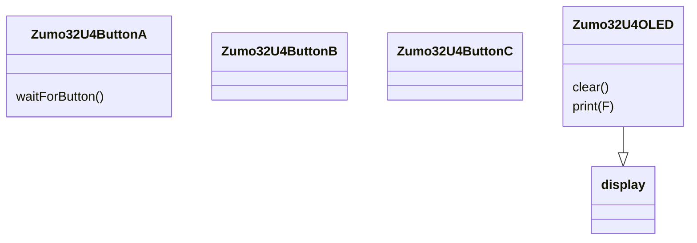

# Klassen

1.  Noteer de klassen die je in deze code tegen komt.
   ```C++
Zumo32U4ButtonA
Zumo32U4ButtonB
Zumo32U4ButtonC
Zumo32U4OLED
```
2.  Noteer de objecten die je in deze code tegenkomt.
   ```c++
   buttonA 
   buttonB 
   buttonC 
   ```
3.   Noteer alle operaties bij alle klassen die je op basis van deze code kunt ontdekken.



