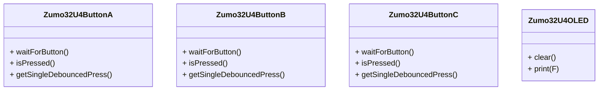

# Klassen

1.  Noteer de klassen die je in deze code tegen komt.
```cpp
Zumo32U4ButtonA
Zumo32U4ButtonB
Zumo32U4ButtonC
Zumo32U4OLED
```
2.  Noteer de objecten die je in deze code tegenkomt.
   ```cpp
   buttonA 
   buttonB 
   buttonC
   display 
   led 
   ```
3.   Noteer alle operaties bij alle klassen die je op basis van deze code kunt ontdekken.


---
```cpp
/*! \brief General pushbutton class that handles debouncing.
 *
 * This is an abstract class used for interfacing with pushbuttons.  It knows
 * about debouncing, but it knows nothing about how to read the current state of
 * the button.  The functions in this class get the current state of the button
 * by calling isPressed(), a virtual function which must be implemented in a
 * subclass of PushbuttonBase, such as Pushbutton.
 *
 * Most users of this library do not need to directly use PushbuttonBase or even
 * know that it exists.  They can use Pushbutton instead.*/
class PushbuttonBase
{
public:

  /*! \brief Waits until the button is pressed and takes care of debouncing.
   *
   * This function waits until the button is in the pressed state and then
   * returns.  Note that if the button is already pressed when you call this
   * function, it will return quickly (in 10 ms). */
  void waitForPress();

  /*! \brief Waits until the button is released and takes care of debouncing.
   *
   * This function waits until the button is in the released state and then
   * returns.  Note that if the button is already released when you call this
   * function, it will return quickly (in 10 ms). */
  void waitForRelease();

  /*! \brief Waits until the button is pressed and then waits until the button
   *  is released, taking care of debouncing.
   *
   * This is equivalent to calling waitForPress() and then waitForRelease(). */
  void waitForButton();

  /*! \brief Uses a state machine to return true once after each time it detects
   *  the button moving from the released state to the pressed state.
   *
   * This is a non-blocking function that is meant to be called repeatedly in a
   * loop.  Each time it is called, it updates a state machine that monitors the
   * state of the button.  When it detects the button changing from the released
   * state to the pressed state, with debouncing, it returns true. */
  bool getSingleDebouncedPress();

  /*! \brief Uses a state machine to return true once after each time it detects the button moving from the pressed state to the released state.
   *
   * This is just like getSingleDebouncedPress() except it has a separate state
   * machine and it watches for when the button goes from the pressed state to
   * the released state.
   *
   * There is no strict guarantee that every debounced button press event
   * returned by getSingleDebouncedPress() will have a corresponding
   * button release event returned by getSingleDebouncedRelease(); the two
   * functions use independent state machines and sample the button at different
   * times. */
  bool getSingleDebouncedRelease();

  /*! \brief indicates whether button is currently pressed without any debouncing.
   *
   * @return 1 if the button is pressed right now, 0 if it is not.
   *
   * This function must be implemented in a subclass of PushbuttonBase, such as
   * Pushbutton. */
  virtual bool isPressed() = 0;

private:

  PushbuttonStateMachine pressState;
  PushbuttonStateMachine releaseState;
};
```

1.  Zet alle informatie die je gevonden hebt in een klassendiagram in UMLet.
2.  Noteer alle vragen die je hebt over deze code. Wat begrijp je (nog) niet? Wat vindt je raar?

---

1.  Wat wordt hier in deze code gedefinieerd?
	1. De public en private functies
	2. De 
2.  Zet deze code om naar UML (in UMLet).
3.  Noteer alle vragen die je hebt over deze code. Wat begrijp je (nog) niet? Wat vindt je raar?

