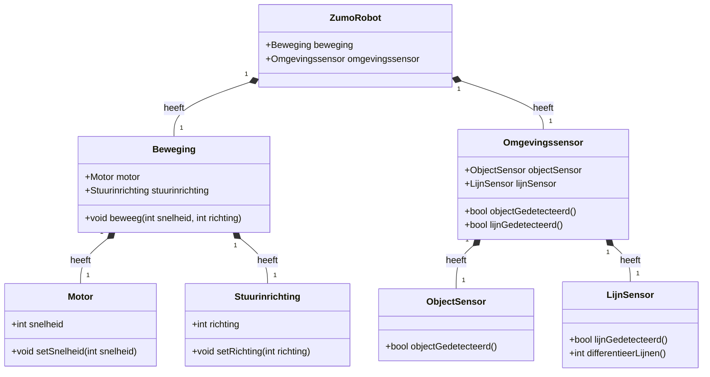

# Practicum UML (Systems Engineering)

## Tweede weekopdracht

### review van een ontwerp

Zie het volgende (onvolledige) klassendiagram

  

Dit is het eerste concept klassendiagram voor de Zumo robot waarbij de bedoeling is dat de robot een lijn kan volgen en ondertussen nergens tegenaan botst. De Zumo moet de afgelegde afstand en richting kunnen onthouden.

1.  Kijk naar het klassendiagram, en noteer wat je opvalt.
	1. Alle klassen gaan naar de Zumo
2.  Pak een blaadje en schrijf alle verantwoordelijkheden (taken) op die moeten gebeuren om de Zumo correct te laten rijden. Denk goed na over je lijstje, maak hem gedetailleerd!
	1. De zumo moet een motor hebben
	2. De zumo moet kunnen sturen
	3. De zumo moet een sensor hebben om te kijken of er objecten voor de zumo staan 
	4. De zumo moet een sensor hebben om de lijnen te kunnen zien en differentiëren 
3.  Probeer nu alle verantwoordelijkheden te koppelen aan de klassen ven het bovenstaande diagram. Wat valt je nu op??
	1. De klassen staan er
4.  lees [What Is a God Class and Why Should We Avoid It?](https://linearb.io/blog/what-is-a-god-class/). Er staan termen genoemd die je waarschijnlijk nog niet zo veel zeggen, lees daar voor nu even overheen. Het is belangrijk dan je de 'Fundamentals' begrijpt. Van de rest is een globaal overzicht voldoende.
	- [x] 
1.  Nu de ingewikkelde vraag: Doe een voorstel voor een beter klassendiagram

### Overerving

Kijk nog eens naar het klassendiagram hierboven.

1.  Er zit een mogelijkheid tot overerving in dit klassendiagram, die niet is benut. Wellicht heb je dat bij je eigen verbeterde diagram ook wel over het hoofd gezien. Voeg de overerving toe.
2.  Maak in je klassendiagram de associaties compleet. (richting, multipliciteiten, rollen, namen van associaties…)