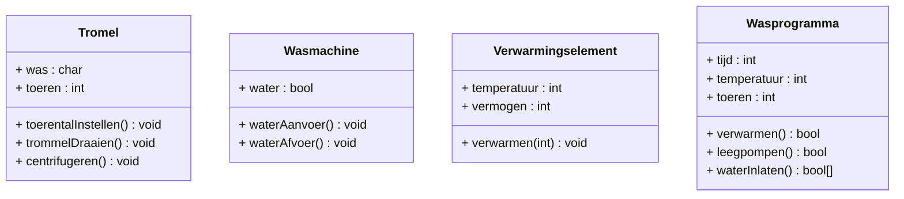

# Practicum UML (Systems Engineering)

## Derde weekopdracht

### De Wasmachine

We willen een wasmachine gaan modelleren. Als we een klassendiagram maken van de fysieke elementen van een wasmachine zouden we op deze eerste schets van een model uit kunnen komen:

![[Pasted image 20230508132945.png]]

fig 1. de wasmachine

De wasmachine heeft een trommel die door een motor wordt aangedreven. Een verwarmingselement verwarmd het water en maakt daarbij ook gebruik van een temperatuursensor om de warmte van het water te meten. Verder moet er water in en uit de wasmachine kunnen lopen en daar in een pomp voor (water wegpompen) en een kraan (water binnen laten). De watersensor meet hoe vol de wasmachine met water staat.

## Naar een klassendiagram

Het model in figuur 1 geeft goed aan welke onderdelen in een wasmachine zitten, maar is geen goed model om de software voor de aansturing van de wasmachine op te baseren. Denk nog maar een terug aan vorig practicum…

### opdracht 1

Waar zit in figuur 1. de god-klasse??
> Bij de was machine
---
We willen dus de verantwoordelijkheden beter verdelen over de verschillende klassen. Als we dat willen doen zullen we eerst moeten nadenken over wat die verantwoordelijkheden zijn, die een wasmachine heeft.  
Als ik een eerste poging doe dan kom ik tot een volgende lijst:

-   Een trommel die moet draaien. In de trommel stop je de was, en die trommel kan dan draaien. Meestal draait een trommel ofwel langzaam, en dan verandert hij regelmatig van richting, ofwel hij draait snel in 1 richting. Dat laatste is centrifugeren. Je kunt dan ook het aantal toeren kiezen.
-   De wasmachine moet water in en uit kunnen laten zodat de was in de trommel ook met het water in aanraking komt. De wasmachine loopt vol door een kraan open te zetten, maar voor het leeg laten lopen is een pomp nodig.
-   Het verwarmen. Het water in de wasmachine moet verwarmd kunnen worden tot een bij het wasprogramma ingestelde temperatuur. Het verwarmingselement heeft een vermogen wat instelbaar is.
-   Het wasprogramma is het “recept” dat je met volgen. Dus bv: eerst water inlaten, dan verwarmen tot 40 graden, dan een uur langzaam draaien, dan leegpompen, dan weer water inlaten (spoelen), een kwartier langzaam draaien, leegpompen, 10 min snel draaien op 800 toeren.

Als je op basis hiervan een klassendiagram opstelt, kom je tot heel andere modellen dan figuur 1.

---

### opdracht 2

1.  Maak een klassendiagram op basis van de bulletlijst hierboven. Elke bullet word 1 klasse.
2.  Kijk nu naar figuur 1 en vul je klassendiagram aan met de klassen die je in figuur 1 wel hebt, maar nog denkt te missen in je nieuwe klassendiagram.
3.  Als je Wasmachine nu 4 wasprogramma’s heeft, hoe ziet dan een objectendiagram eruit?

---

### opdracht 3

1.  Maak je diagram zo compleet mogelijk. Denk aan: attributen, operaties, visability, static operatoren, constructoren e.d.  
    Waarschijnlijk mis je nog veel informatie om hier een echt systeem van te maken, vandaar dat er in de opdracht ‘zo compleet mogelijk’ staat. Volgende week gaan we kijken naar sequentiediagrammen, en die gaan helpen het wat completer te maken.
2.  Vertaal wat je nu hebt alvast naar c++ code.

---